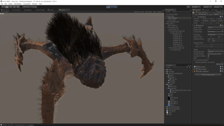
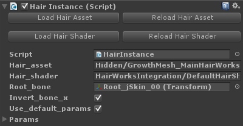
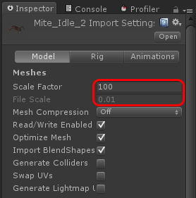

[English](https://translate.google.com/translate?sl=ja&tl=en&u=https://github.com/unity3d-jp/NVIDIAHairWorksIntegration/) (by Google Translate)
# NVIDIA Hair Works Integration

NVIDIA Hair Works の Unity インテグレーションです。
MAYA や 3ds Max でオーサリングした Hair データを Unity で表示させることができます。  

## How To use
**Unity 5.2 以降、かつ Windows & D3D11 専用です**。  
使用には少々面倒な前準備が必要です。
Hair Works SDK は再配布が認められていないため、各自個別に NVIDIA の開発者サイトから入手してプロジェクトへインポートする必要があります。
以下に手順を記します。現状 SDK はバージョン 1.1.1 を前提としています。

1.  [このパッケージ](https://github.com/unity3d-jp/NVIDIAHairWorksIntegration/raw/master/Packages/HairWorksIntegration.unitypackage) をプロジェクトへインポート
2.  Hair Works SDK を入手
  * https://developer.nvidia.com/gameworksdownload ここの NVIDIA HairWorks -> HairWorks 1.1.1
  * ダウンロードには NVIDIA の開発者アカウントが必要です。アカウント作成は無料ですが、申請から作成されるまでに 1 日前後時間がかかります。
  * MAYA や 3ds Max のプラグインもここから入手できます
3.  Hair Works SDK に含まれる必要なファイルをプロジェクトへインポート
  * HairWorks-r1_1_1-62/HairWorks/bin/win64/GFSDK_HairWorks.win64.dll を Assets/UTJ/Plugins/x86_64 の中にコピー

シェーダをカスタマイズしたい場合、hair には Unity のシェーダは使えないので独自に HLSL を書いてコンパイルする必要があります。
シェーダやプラグイン本体をビルドしたい場合、HairWorks-r1_1_1-62/HairWorks ディレクトリをまるごと Plugin/Externals の中にコピーしてから Plugin/HairWorksIntegration.sln をビルドします。  
ちなみにスクリーンショットの虫は SDK 付属のサンプルで、media/Mite にあります。

### Hair Instance Component
  
前提として、現状 hair 関連のデータ (.apx, .cso ファイル) は、Assets/StreamingAssets 以下に置く必要があります。
- "Load Hair Asset": hair のアセットファイル (.apx) を指定します。  
- "Load Hair Shader": hair のシェーダ (.cso = コンパイルされた HLSL) を指定します。
最初からデフォルトのシェーダが指定されており、変える必要があるケースは稀だと思われます。
- "Reload Hair Asset/Shader": 実行中に .apx や .cso を更新した場合、それを反映させるにはこのボタンを押します。
- Root_bone: bone の root となるオブジェクトを指定します。
SkinnedMeshRenderer がある場合、それの Root_bone がデフォルトで指定されています。
- Invert_bone_x: チェックすると bone の x 座標を反転する処理が入ります。
**FBX との座標系を一致させるためにこの設定が必要になるケースがあります**。後述の FBX のロード設定にも注意を払う必要があります。
- Params: hair の色やシミュレーションのパラメータを設定します。
これらのパラメータは .apx ファイルにも含まれており、デフォルトでそれが設定されています。
細かい調整にはこちらを使うといいでしょう。

**モデルの座標の単位に注意が必要です**。  
現状 hair はスケールをかけると結果が正しくなくなってしまいます。  
Unity ではモデルはインポート時に File Scale によるスケールがかかりますが、
.apx のデータはこのスケールがかかる前の座標系になっています。  
面倒なことに File Scale は 0.01 になっていることがよくあり、
こういう場合 .apx の座標系と Unity の座標系を一致させる必要があります。
DCC ツール側で File Scale が 1 になるように変更するか、
Unity 側で Scale Factor * File Scale が 1 になるように調整してスケーリングをキャンセルします。
後者の場合超でかくなってしまうので、前者による解決が望ましいでしょう。  
参考: [Import settings](http://answers.unity3d.com/questions/12187/import-settings.html)  
  

### Hair Light Component
Hair をライティングするにはこのコンポーネントが必要です。通常の Light オブジェクトに追加します。
  
大体見たまんまです。copy_light_params をチェックすると Light コンポーネントのパラメータをコピーして使うようになります。

## Known Issue & ToDo
- 影
  - 近い先に対応予定
- テクスチャによる hair の色、長さ、分布などの指定
  - 近い先に対応予定
- アンチエイリアス
  - 考え中
- Hair のアセットやシェーダは StreamingAssets に丸裸の状態で置く必要がある
  - いずれ他の選択肢も用意する予定
- パラメータの設定項目が膨大でわかりにくい
  - いい改善アイデアがあれば対応予定
- スケールをかけるとおかしくなる
  - 対処したいものの方法が思いつかず、未定…

## Warning
**Hair Works を含む NVIDIA GameWorks SDK は、使用する場合 NVIDIA のロゴの表示義務が生じます**。
これは本プラグインを使用する場合にも適用されます。使用の際はこちらをよく確認してそれに従ってください。  
[GameWorks SDK EULA](https://developer.nvidia.com/gameworks-sdk-eula)  

大雑把にまとめると、ゲームの開始画面、マニュアル、プレスリリースなどに [NVIDIA Game Works のロゴ](https://developer.nvidia.com/gameworks-logo) の表示義務が生じ、加えて商用利用の場合は NVIDIA へその旨を報告する必要がある、といったものです。ライセンス料の類は特にないようです。

## License
[MIT](HairWorksIntegration/Assets/StreamingAssets/UTJ/HairWorksIntegration/License.txt)
