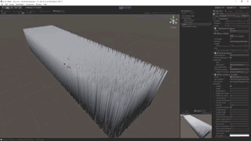

# NVIDIA Hair Works Integration

NVIDIA Hair Works の Unity インテグレーションです。
MAYA や 3ds Max でオーサリングした Hair データを Unity で表示させることができます。  
まだまだ作りかけて色々おかしいですが、上記スクリーンショットくらいのことはできるようになっています。

使用には少々面倒な手順が必要です。
Hair Works SDK は再配布が認められていないため、各自個別に NVIDIA の開発者サイトから入手してプロジェクトへインポートする必要があります。
以下に手順を記します。  
(現状 SDK はバージョン 1.1 を前提としています)

1.  このパッケージをプロジェクトへインポート
2.  Hair Works SDK を入手
  * https://developer.nvidia.com/hairworks ここの Download -> HairWorks 1.1
  * ダウンロードには NVIDIA の開発者アカウントが必要です。アカウント作成は無料ですが、申請から作成されるまでに 1 日前後時間がかかります。
3.  Hair Works SDK に含まれる必要なデータをプロジェクトへインポート
  * HairWorks-r1-1-212-distro/bin/win64/GFSDK_HairWorks.win64.dll を Assets/HairWorksIntegration/Plugins の中にコピー

プラグインをビルドしたい場合、HairWorks-r1-1-212-distro ディレクトリをまるごと Plugin/Externals の中にコピーしてから Plugin/HairWorksIntegration.sln をビルドします。

## How To use
todo: 書く

## Warning
**Hair Works を含む NVIDIA GameWorks SDK は使用にあたって NVIDIA ロゴの表示義務などが規定されています**。  
これは本プラグインを使用する場合にも適用されます。使用の際はこちらをよく確認した上でそれに従ってください。  
[GameWorks SDK EULA](https://developer.nvidia.com/gameworks-sdk-eula)  

(大雑把にまとめると、ゲームの開始画面、マニュアル、プレスリリースなどに NVIDIA Game Works のロゴの表示義務が生じ、加えて商用利用の場合は NVIDIA へその旨を報告する必要がある、といったものです)

## License
Copyright (C) 2015 Unity Technologies Japan, G.K.

Permission is hereby granted, free of charge, to any person obtaining a copy of this software and associated documentation files (the "Software"), to deal in the Software without restriction, including without limitation the rights to use, copy, modify, merge, publish, distribute, sublicense, and/or sell copies of the Software, and to permit persons to whom the Software is furnished to do so, subject to the following conditions: The above copyright notice and this permission notice shall be included in all copies or substantial portions of the Software.

THE SOFTWARE IS PROVIDED "AS IS", WITHOUT WARRANTY OF ANY KIND, EXPRESS OR IMPLIED, INCLUDING BUT NOT LIMITED TO THE WARRANTIES OF MERCHANTABILITY, FITNESS FOR A PARTICULAR PURPOSE AND NONINFRINGEMENT. IN NO EVENT SHALL THE AUTHORS OR COPYRIGHT HOLDERS BE LIABLE FOR ANY CLAIM, DAMAGES OR OTHER LIABILITY, WHETHER IN AN ACTION OF CONTRACT, TORT OR OTHERWISE, ARISING FROM, OUT OF OR IN CONNECTION WITH THE SOFTWARE OR THE USE OR OTHER DEALINGS IN THE SOFTWARE.
